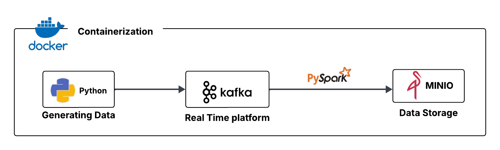

<!-- Improved compatibility of back to top link: See: https://github.com/othneildrew/Best-README-Template/pull/73 -->
<a id="readme-top"></a>
<!--
*** Thanks for checking out the Best-README-Template. If you have a suggestion
*** that would make this better, please fork the repo and create a pull request
*** or simply open an issue with the tag "enhancement".
*** Don't forget to give the project a star!
*** Thanks again! Now go create something AMAZING! :D
-->


<!-- PROJECT SHIELDS -->
<!--
*** I'm using markdown "reference style" links for readability.
*** Reference links are enclosed in brackets [ ] instead of parentheses ( ).
*** See the bottom of this document for the declaration of the reference variables
*** for contributors-url, forks-url, etc. This is an optional, concise syntax you may use.
*** https://www.markdownguide.org/basic-syntax/#reference-style-links
-->
<!-- [![LinkedIn][linkedin-shield]][linkedin-url]
[![Github][github-shield]][github-url] -->


<!-- ABOUT THE PROJECT -->
## A propos du projet

<!-- PROJECT LOGO -->
<br />
<div align="center">
  <a href="https://github.com/HansDoh2404/youtube_videos_2025_lakehouse.git">
    
  </a>
 
  <h3 align="center">kafka_real_time_sale_storage</h3>

  <!-- <p align="center">
    An awesome README template to jumpstart your projects!
    <br />
    <a href="https://github.com/othneildrew/Best-README-Template"><strong>Explore the docs »</strong></a>
    <br />
    <br />
    <a href="https://github.com/othneildrew/Best-README-Template">View Demo</a>
    &middot;
    <a href="https://github.com/othneildrew/Best-README-Template/issues/new?labels=bug&template=bug-report---.md">Report Bug</a>
    &middot;
    <a href="https://github.com/othneildrew/Best-README-Template/issues/new?labels=enhancement&template=feature-request---.md">Request Feature</a>
  </p> -->
</div>

Le projet mis en œuvre est un pipeline de streaming (temps réel) avec kafka et spark pour le traitement des données. Son objectif est de comprendre les principes du temps réels et prendre en main kafka avec la compréhension de ses différents composants. 


## Stack technologique

Les différents outils technologiques utilisés pour son implémentation sont les suivants

* [![Python][python]][python-url]
* [![Pyspark][pyspark]][spark-url]
* [![Kafka][kafka]][kafka-url]
* [![Minio][minio]][minio-url]
* [![Docker][docker]][docker-url]


<!-- GETTING STARTED -->
## Prérequis

Outils à installer avant de débuter

- **Python** : https://www.python.org/downloads/ 
- **Docker** : https://www.docker.com/get-started/


## Installation

1. Cloner le repo
   ```sh
   git clone https://github.com/HansDoh2404/kafka_real_time_sale_storage.git
   ```

2. Se déplacer dans :
   ```sh
   cd kafka_real_time_sale_storage
   ```

3. Après s'être assuré que docker-engine ou docker-desktop est lancé, exécuter :
   ```sh
   docker compose up -d
   ```

4. Exécuter la commande de création du topic et d'autres si nécesssaires
   ```sh
    -- Créer le topic : à exécuter absolument
    docker exec -it kafka kafka-topics \
    --create \
    --topic sales \
    --bootstrap-server localhost:9092 \
    --partitions 6 \
    --replication-factor 1

    -- Lister le topic
    docker exec -it kafka kafka-topics \
    --describe \
    --topic sales \
    --bootstrap-server localhost:9092

    -- Voir la consommation
    docker exec -it kafka kafka-console-consumer \
    --topic sales \
    --from-beginning \
    --bootstrap-server localhost:9092

    -- Voir les messages écrits par le producer
    docker exec -it kafka kafka-console-consumer \
    --bootstrap-server localhost:9092 \
    --topic sales \
    --from-beginning \
    --max-messages 10
   ```


5. Se rendre vers http://localhost:9001 pour créer les chemins *sales* et *checkpoints* dans le bucket *warehouse*

6. Exécutions du producer et du consumer :
    ```sh
     python3 producer.py
     python3 consumer.py
    ```
<!-- CONTACT -->
## Contact

Contributeur : [@Hans Ariel](https://www.linkedin.com/in/hans-ariel-doh-59a31a2ba/) - hansearieldo@gmail.com
<br />
Lien du projet: https://github.com/HansDoh2404/kafka_real_time_sale_storage.git 


<!-- ACKNOWLEDGMENTS -->
## Utiles

* [Shields.io](https://shields.io/) : pour créer les badges dynamiquement
* [Lucid App](https://lucid.app) : pour créer des diagrammes et architectures


<!-- MARKDOWN LINKS & IMAGES -->
[linkedin-shield]: https://img.shields.io/badge/linkedin-%230072B1?style=for-the-badge&logo=LinkedIn
[linkedin-url]: https://www.linkedin.com/in/hans-ariel-doh-59a31a2ba/
[github-shield]: https://img.shields.io/badge/github-black?style=for-the-badge
[github-url]: https://github.com/HansDoh2404
[python]: https://img.shields.io/badge/Python-blue?style=for-the-badge&logo=python&logoColor=white
[python-url]: https://docs.python.org/3/
[kafka]: https://img.shields.io/badge/kafka-black?style=for-the-badge&logo=apache-kafka&logoColor=white&color=black
[kafka-url]: https://kafka.apache.org/41/getting-started/introduction/
[nessie-url]: https://docs.python.org/3/
[pyspark]: https://img.shields.io/badge/pyspark-orange?style=for-the-badge&logo=apache-spark&logoColor=white&color=orange
[spark-url]: https://spark.apache.org/
[minio]: https://img.shields.io/badge/minio-red?style=for-the-badge&logo=minio&logoColor=white
[minio-url]: https://docs.min.io/enterprise/aistor-object-store/
[docker]: https://img.shields.io/badge/docker-%231D63ED?style=for-the-badge&logo=docker&logoColor=white
[docker-url]: https://docs.docker.com/